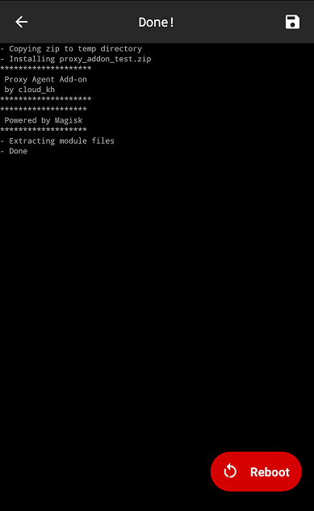

# Proxy Agent
[](https://opensource.org/licenses/Apache-2.0)

Proxy Agent is a tool that is created to ease the proxy connection setup process between a rooted Android device to a computer that is running BurpSuite.

The goal of Proxy Agent is to enable a seamless proxy setup experience for Mobile Pentesters/Security Researchers, freeing them from the lengthy proxy setup process and Burp CA Certificate import process, enabling them to spend their time discovering new vulnerabilities instead 😊

Proxy Agent consists of Proxy Agent, an Android Application and Proxy Agent Add-on, a Magisk module.

The Android Application provides the UI for the user and holds most of the functions that are needed to run the tool, while the Magisk module helps move Burp's CA Certificate from the user store to the system store.

The Magisk module is inspired by [MagiskTrustUserCerts](https://github.com/NVISOsecurity/MagiskTrustUserCerts) which provides almost the same function with the Proxy Agent Add-on, albeit with slight modifications. If you have MagiskTrustUserCerts installed in your Magisk, you do not need to install the Proxy Agent Add-on.

Note: Tested on Android 7 (Nexus 6P), Android 10 (Redmi Note 8), and Android 11 (Google Pixel 3XL)

## Instructions for Installation

### Prerequisite

To deploy Proxy Agent, you would require:
1. A rooted Android phone.
2. With [Magisk Manager](https://github.com/topjohnwu/Magisk) installed.

And... That's it!

### Installation

To begin installation, download the APK file and Magisk module in the [Release](https://github.com/cloudkanghao/ProxyAgent/releases/tag/v1).

### Installing Proxy Agent (Android Application)

1. Use the `install` command to install the APK file.

```
adb install proxyagent.apk
```

2. Install the APK file by clicking on it.

### Installing Proxy Agent Add-on (Magisk Module)

1. Push the `Proxy_Agent_Addon.zip` file into your Android's Download folder.

```
adb push Proxy_Agent_Addon.zip /storage/emulated/0/Download
```

2. Once it is done, launch Magisk Manager, click on the Modules tab and press `Install from storage`.

3. Locate the `Proxy_Agent_Addon.zip` zip file and install it.


## I have followed the setup, but it still doesn't work?!

1. Try connecting to adb shell on your Android device and do a ping to your computer's IP address that is hosting BurpSuite
2. Setup the firewall rule in your computer to allow incoming and outgoing traffic at port 8080 (To your BurpSuite's port)
3. Try to import BurpSuite CA Certificate again

## What's next?

1. Plans to make the installation easier
2. Addition of more features like SSL pinning bypass and more..